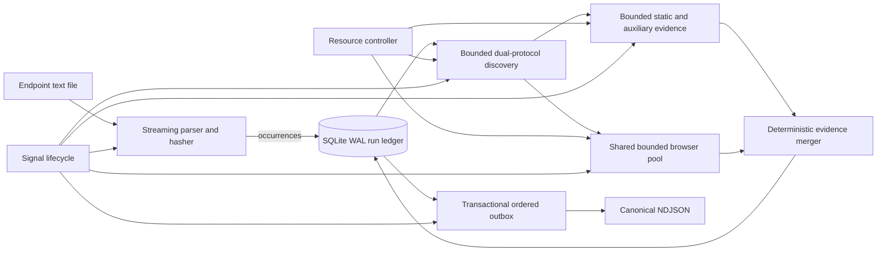

# Lossless IP:Port Complete Scanner

## Goal Capsule

Turn the CLI into a zero-configuration, file-driven scanner whose only required
input is a UTF-8 text file containing one `IP:port` endpoint per line. The
scanner must discover every viable HTTP protocol on the supplied port, apply
all supported static and runtime detection channels without speed-oriented
quality reductions, use the machine's effective resources safely, and produce
durable, resumable, deterministic records without silently dropping any input.
Here and in machine output, `complete` means complete evidence collection for
default services reachable through the supplied literal endpoint; it cannot
enumerate hostname-routed virtual hosts or SNI names absent from the input.

Success means:

- every non-ignored physical input line has exactly one durable terminal target
  outcome;
- every live HTTP and HTTPS service on the supplied port is scanned and reported;
- successful empty detections are distinct from invalid, unreachable, partial,
  cancelled, and internal-failure outcomes;
- memory and queued work are bounded by selected concurrency, not file length;
- repeated serialization of identical committed observations produces
  byte-identical canonical exports;
- complete-mode detections are equivalent to the union of all supported
  HTTP/balanced and browser-extension evidence channels;
- the automated coverage matrix proves every declared channel, lifecycle state,
  parser branch, and recovery boundary.

## Product Contract

### Actors

- **A1 — Authorized operator:** owns or is permitted to assess every supplied
  endpoint and wants a single-command scan.
- **A2 — Automated consumer:** reads stable records and determines progress,
  target outcomes, and run completion without scraping human logs.
- **A3 — Maintainer:** updates fingerprints and scanner internals while relying
  on CI to detect coverage, determinism, or throughput regressions.

### Requirements

- **R1 — File-only direct entry.** The canonical CLI accepts one existing text
  file as its only required operand. A missing path is a file error and is never
  reinterpreted as a hostname or URL. The existing `-i` URL/file CLI and Python
  URL APIs remain available as legacy compatibility paths; they do not share
  direct-entry artifact or resume semantics.
- **R2 — Strict endpoint grammar.** Accept IPv4 as `address:port` and IPv6 only
  as `[address]:port`, with ports from 1 through 65535. Reject schemes,
  hostnames, CIDRs, paths, user information, queries, fragments, zone
  identifiers, ambiguous IPv4, unbracketed IPv6, NUL bytes, invalid UTF-8, and
  lines longer than 1 KiB before network activity.
- **R3 — Explicit line semantics.** Strip a UTF-8 BOM at file start and outer
  whitespace. Ignore blank lines and full-line comments whose first
  non-whitespace character is `#`, after enforcing byte length, NUL, and UTF-8
  validity. Reject inline comments. Preserve physical line number, byte offset,
  and occurrence sequence for every non-ignored line. Accepted lines include a
  normalized endpoint; rejected lines include null plus sanitized error
  metadata and a bounded integrity digest.
- **R4 — Lossless occurrence accounting.** Emit exactly one terminal target
  record for each non-ignored occurrence, including malformed and duplicate
  lines. Exact normalized duplicates may share endpoint work through a
  disk-backed identity, but each occurrence receives its own durable outcome
  and source identity.
- **R5 — Exhaustive protocol discovery.** Probe HTTP and HTTPS independently on
  the supplied port without port-based scheme assumptions. Any valid HTTP
  response status establishes reachability. TLS presence, TLS trust, protocol
  unavailability, and indeterminate probe failure are separate facts.
- **R6 — Exhaustive endpoint scanning.** Scan both protocols when both are live,
  even if they redirect to the same destination. Keep requested endpoint,
  requested URL, effective URL, protocol, redirect metadata, HTTP status, TLS
  state, technologies, and per-stage errors distinct.
- **R7 — Complete evidence profile.** The direct-entry workflow runs a
  complete profile that deterministically combines all supported static,
  auxiliary, network, and browser-runtime evidence. It must not block
  evidence-bearing resources, shorten analysis settlement, substitute a
  lower-quality scan mode, or skip a channel in response to load.
- **R8 — Detection-preserving adaptation.** Runtime adaptation may change only
  concurrency and admission rate. It may not change timeouts, evidence limits,
  protocol coverage, retries, resource blocking, fingerprint data, or scan
  semantics.
- **R9 — Bounded execution.** Input reading, protocol discovery, static
  analysis, browser analysis, result ordering, and output serialization use
  bounded queues or admission permits. Execution permits are released after
  durable endpoint-result commit; a separate disk-backed projection cursor
  preserves input order without allowing an early slow target to idle workers.
  Coordinator memory is independent of input length after fixed worker
  baselines.
- **R10 — Resource-aware saturation.** Automatically size stage concurrency
  from effective CPU affinity/quota, available cgroup/host memory, file
  descriptors, process limits, sockets, shared/temporary storage, artifact disk
  space, and measured browser footprint. Resource leases are vectors rather
  than target counts so nested protocol, DNS, asset, TLS, and browser work
  cannot multiply beyond the run budget. Zero workers is a valid selection
  that fails preflight with `insufficient_resources`. Keep healthy workers
  saturated while work exists and expose requested, selected, and effective
  capacity plus degradation reasons.
- **R11 — Durable lifecycle.** Maintain a versioned run ledger and
  transactional event outbox. Persist separate ingestion, execution,
  projection, publication, and completion phases. A run is complete only after
  immutable input EOF is validated, every occurrence is terminal, all required
  protocol/channel stages resolve, all claims and queues drain, canonical
  output and manifest digests match durable ledger frontiers, summary counters
  are recomputed and reconcile, and all workers close.
- **R12 — Automatic compatible resume.** On restart, resume an interrupted run
  only when the immutable input fingerprint, semantic run specification,
  serializer/schema versions, scanner build identity, fingerprint and
  extension hashes, and browser/runtime versions match. Resource capacities are
  operational metadata, not semantic identity, after parity tests prove they
  cannot affect results. Reject live locks, corrupt authoritative ledgers, and
  incompatible incomplete state without mutation. A compatible incomplete run
  with healthy ledger/outbox may preserve and rebuild a damaged staging
  projection. A completed run causes a new immutable generation rather than
  overwrite.
- **R13 — Deterministic machine output.** Write compact versioned NDJSON in
  physical input order, with endpoint results in fixed HTTP-then-HTTPS order,
  stable key order, sorted technologies, canonical error codes, UTF-8, and one
  trailing newline after every record; zero records produce a zero-byte file.
  Keep timestamps, durations, process IDs, and raw exception text outside
  canonical records. Determinism means identical committed
  observations serialize identically; live network observations are not
  assumed stable.
- **R14 — Stable failure taxonomy.** Distinguish at least invalid input,
  unreachable, TLS untrusted, discovery timeout, scan timeout, partial,
  successful empty detection, successful detection, cancelled, output failure,
  worker failure, and internal failure. Target failures are data; invocation,
  state, output, infrastructure, and interruption failures control process
  failure. A completed run with zero accepted endpoints exits nonzero after
  persisting all invalid/ignored accounting.
- **R15 — Safe interruption.** The first termination signal stops admission,
  lets finished work commit, returns cancelled or in-flight claims to pending
  without terminalizing them, closes workers, and marks the run interrupted.
  Signal handlers perform no storage or file I/O. A second signal forces
  termination. Resume recovers pending claims by execution epoch from the last
  valid transaction without gaps or duplicate terminal records.
- **R16 — Redirect boundary.** Discovery never follows redirects. Complete
  scanning follows bounded redirects needed for detection, records the
  authority transition, and never forwards operator cookies or credentials
  across authorities. Direct-mode egress always allows supplied literal
  endpoints and public destinations, but blocks loopback, link-local,
  metadata, private/ULA, multicast, unspecified, and DNS-rebinding destinations
  reached through redirects or subresources unless that resolved address was
  explicitly supplied.
- **R17 — Coverage contract.** CI separately reports and enforces code
  statement/branch coverage, fingerprint-plan completeness, per-channel
  operational coverage, endpoint-ingestion coverage, lifecycle/recovery
  coverage, determinism, and bounded-resource behavior.
- **R18 — Python compatibility.** The baseline implementation behaves
  identically on supported Python 3.9 through 3.14 and does not depend on
  newer-only executor or queue APIs.
- **R19 — Compatibility boundary.** Existing `analyze()` and `analyze_many()`
  URL behavior remains available. The new streaming run API is authoritative
  for direct-entry execution; the dictionary-returning batch API remains a
  finite compatibility collector and is not used by the file CLI.
- **R20 — Immutable input admission.** Complete streaming parse and hash into
  the ledger before any network work starts, recording source byte ranges,
  line-boundary prefix digests, and final EOF digest. Resume verifies the full
  byte stream before reusing prior results, including same-size or in-place
  changes.
- **R21 — Privacy-preserving persistence.** Persist canonical error codes and
  bounded sanitized diagnostics only. Durable artifacts and stderr never store
  raw response bodies, cookies, authorization values, sensitive headers,
  redirect user information, unredacted sensitive queries, or malformed input
  bytes; integrity uses bounded hashes.
- **R22 — Evidence completeness accounting.** Every channel records whether
  count, byte, timer, redirect, policy, or worker limits truncated observable
  evidence. Any truncation makes the protocol or target aggregate `partial`,
  never `success` or `success_empty`.

### Key Flows

- **F1 — New run:** operator supplies a readable file; the scanner reserves
  sibling artifacts, fully ingests and fingerprints an immutable byte stream,
  selects resources, discovers both protocols, scans every live endpoint
  completely, commits results, projects ordered records, reconciles counters,
  publishes artifacts, and marks the run complete last.
- **F2 — Mixed input:** ignored blank/comment lines affect manifest counters;
  malformed lines receive ordered `invalid_input` records without network
  calls; valid lines continue.
- **F3 — Dual protocol:** both HTTP and HTTPS answer on one port; both receive
  complete scans and remain separate endpoint results under one target record.
- **F4 — Untrusted TLS:** discovery identifies TLS but trust validation fails;
  complete scanning continues in isolated insecure mode for coverage and
  reports the trust failure prominently rather than classifying the service as
  absent.
- **F5 — Partial endpoint:** at least one live protocol produces useful
  evidence while another protocol or scan stage remains indeterminate or
  fails; the durable target status is `partial`, preserving all evidence and
  stage errors.
- **F6 — Interruption and resume:** admission stops, durable work drains, the
  run is marked interrupted, and a later identical invocation resumes from the
  ledger by resetting stale claims to pending without re-emitting committed
  occurrence outcomes.
- **F7 — Duplicate endpoint:** repeated normalized endpoints share discovered
  and scanned endpoint facts when their semantic scan identity matches, while
  each source occurrence is exported independently in input order.
- **F8 — Artifact conflict:** a live lock, completed run, incompatible
  manifest, authoritative corruption, or changed input prevents silent reuse.
  Compatible staging damage is rebuilt; a completed run starts a fresh
  generation; all other conflicts terminate without altering prior evidence.

### Acceptance Examples

- **AE1 (R1, R2, R3):** a file containing CRLF, a BOM, comments,
  `192.0.2.10:80`, and `[2001:db8::10]:8443` starts without options; ignored
  records are counted and both endpoints are admitted with stable identities.
- **AE2 (R2, R4):** `01.2.3.4:80`, `host:443`, `1.2.3.4:0`, an overlong line,
  invalid UTF-8, and unbracketed IPv6 each produce an ordered
  `invalid_input` terminal record and zero network calls.
- **AE3 (R5, R6):** TLS on port 80 and cleartext HTTP on port 443 are both
  discovered correctly; a dual-protocol random port produces two endpoint
  results in HTTP-then-HTTPS order.
- **AE4 (R4, R7):** two identical input lines produce two occurrence records
  whose endpoint detections are complete and identical, without duplicate
  browser work.
- **AE5 (R7, R8, R17):** complete-profile output has detection parity across
  one worker, automatic workers, and constrained cgroups for fixtures covering
  every declared fingerprint channel.
- **AE6 (R9):** streaming-generated fake-backend runs over one million and ten
  million lines have coordinator anonymous-RSS within 32 MiB after fixed worker
  baselines; every queue/future/batch stays within its count and byte cap, while
  process-tree and cgroup memory are separately bounded and reported.
- **AE7 (R11, R13):** randomized completion delays across 100 fixture or replay
  runs with identical observations produce byte-identical NDJSON and reconciled
  manifest counters.
- **AE8 (R12, R15):** injected graceful and forced termination at reader,
  worker, transaction, serialization, flush, and sync boundaries resumes to
  every occurrence exactly once with no malformed middle record.
- **AE9 (R10):** under 1/2/4 CPU and 1/2/4 GiB cgroups, selected workers never
  exceed calculated CPU, memory, process, temporary/shared-storage, or
  descriptor admission budgets; representative heavy-page fixtures stay at or
  below 85% peak cgroup memory with no OOM event, insufficient capacity refuses
  cleanly, and effective workers remain saturated while eligible work exists.
- **AE10 (R14):** a reachable page with zero technologies is `success_empty`;
  closed ports are `unreachable`; expired/self-signed TLS is
  `tls_untrusted` with scan evidence; extension analysis timeout is `partial`,
  never an empty success.
- **AE11 (R16):** a cross-authority redirect is recorded, detection continues,
  and no cookie or authorization material reaches the new authority.
- **AE12 (R17):** each supported channel has a registered positive and negative
  fixture in its owning scan path, and runtime-only JavaScript/XHR channels
  have explicit non-manufacture tests in HTTP-only paths.

### Scope

#### In scope

- strict IP endpoint-file parsing;
- exhaustive same-port HTTP/HTTPS discovery;
- complete hybrid evidence collection and deterministic merging;
- bounded stage scheduling and resource selection;
- durable run state, ordered NDJSON, interruption, and automatic resume;
- stable programmatic schemas and library iterators;
- complete operational, lifecycle, performance, and code coverage;
- documentation, container behavior, and CI enforcement.

#### Out of scope

- CIDR expansion, port expansion, DNS hostname input, virtual-host enumeration,
  TLS SNI guessing, or discovery of sites not reachable through the supplied
  literal IP;
- credentials, authentication workflows, or cookie input in direct-entry mode;
- distributed multi-machine coordination;
- arbitrary plugin execution or remote control APIs;
- changing upstream Wappalyzer fingerprint meaning.

### Product Contract Key Decisions

- **KTD1 — Quality profile:** `session-settled: user-directed`. Direct-entry
  always uses complete hybrid detection. Fast and balanced remain library and
  legacy URL modes, not automatic quality fallbacks. Reject lower-quality
  adaptation because it violates R7 and the user's no-miss constraint.
- **KTD2 — Both protocols:** `session-settled: user-directed`. Probe and scan
  HTTP and HTTPS independently on every port. Reject HTTPS-first fallback
  because simultaneously live cleartext services would be missed.
- **KTD3 — TLS trust:** continue complete scanning through certificate trust
  failures in isolated endpoint mode while recording trust metadata. Reject
  treating trust failure as unreachability because literal-IP certificates are
  commonly untrusted and coverage would collapse.
- **KTD4 — Duplicate execution:** preserve occurrence identity while sharing
  immutable endpoint work for exact normalized duplicates within one run.
  Reject result maps keyed only by endpoint because they lose source
  occurrences; reject unconditional rescan because it wastes browser capacity
  without expanding endpoint coverage.
- **KTD5 — State authority:** use a standard-library SQLite WAL ledger with a
  transactional outbox as lifecycle truth. Store canonical row bytes, lengths,
  payload digests, expected output offsets, and chained prefix digests. Project
  and synchronize bounded output groups, then advance a durable projection
  cursor; recovery byte-compares the tail with outbox payloads and truncates
  only after the verified prefix. Freeze expected counts and artifact digests,
  publish output and manifest, join workers, and commit run completion last.
  Reject a sidecar checkpoint as sole truth because it cannot atomically
  reconcile deduplication, retries, endpoint stages, and occurrence output.
- **KTD6 — Determinism:** make canonical output input-ordered and keep live
  progress on stderr/run metadata. Reject completion-order canonical output
  because it is scheduler-dependent.
- **KTD7 — Redirects:** follow bounded redirects during complete scanning,
  including authority changes, because redirect destinations are part of the
  observed endpoint behavior. Record scope changes and strip cross-authority
  credentials.
- **KTD8 — Coverage terminology:** require both 100% declared operational
  matrix coverage and 100% statement/branch coverage for newly introduced
  orchestration modules. Raise whole-package coverage to the highest honest
  enforced value achieved by executable tests; no exclusion or pragma may hide
  reachable first-party behavior. This avoids representing a percentage as
  evidence of technology-detection completeness.
- **KTD9 — Distinct complete profile:** direct entry uses a new internal
  complete profile that merges static/auxiliary and browser evidence. Legacy
  `full` remains browser-only with unchanged URL API, callback, error, cookie,
  keying, and duplicate-collapse behavior.
- **KTD10 — Immutable semantic run specification:** snapshot parser, schema,
  serializer, complete-engine, redirect, TLS, retry, timeout, per-channel
  evidence-limit, fingerprint, extension, and runtime identities before
  ingestion. Reject or isolate ambient proxy, netrc, cookie, browser-resource
  blocking, and legacy environment controls in direct mode. Operational
  concurrency is recorded separately.
- **KTD11 — Narrow certificate exception:** verified endpoints use the shared
  verified pool. An untrusted endpoint uses an ephemeral Chromium process whose
  launch-time certificate exception is restricted to the discovered
  certificate SPKI, so cross-origin evidence remains available under normal
  trust validation. A redirect with a different untrusted certificate starts a
  separately constrained process. Reject context-wide or globally insecure
  persistent pools because they expand trust bypass beyond the observed
  certificate.
- **KTD12 — Single raw-evidence resolver:** static and browser stages return
  channel-tagged raw candidates with stable provenance and deduplication keys.
  One merger performs confidence/version selection and
  requires/implies/excludes enrichment exactly once. Reject merging already
  enriched technology maps because it can double confidence and erase channel
  identity.
- **KTD13 — Coordinator-owned resource broker:** direct mode performs network,
  DNS, TLS, and asset I/O through coordinator-owned async/thread transports and
  leases; CPU-only parsing/matching runs in spawned processes with no nested
  pools. This makes vector budgets enforceable across process boundaries and
  allows a hung regex worker to be terminated and replaced without losing the
  run.
- **KTD14 — Outcome hierarchy:** run state, occurrence aggregate, protocol
  result, stage result, and TLS/policy metadata are separate schema levels.
  Occurrence status is one of `invalid_input`, `unreachable`, `partial`,
  `success_empty`, or `success`; TLS trust is metadata, and any unresolved live
  protocol or truncated stage promotes the occurrence to `partial`.
- **KTD15 — Observation coherence:** each HTTP/browser stage records effective
  URL and bounded response-identity metadata. When stage observations diverge,
  keep stage-scoped detections and label the aggregate `multi_observation`
  rather than presenting a technology/version combination as one response.

### Resolved During Planning

- Runs use immutable generation directories under a derived
  `<input>.wappalyzer-runs/` sibling when writable, otherwise a private
  platform state directory keyed by canonical input identity. Each generation
  contains ledger, NDJSON, manifest, lock, and temporary artifacts. Canonical
  stdout is available only through an explicit compatibility/export path and
  is not resumable.
- A zero-option invocation resumes the latest compatible incomplete generation
  or starts a new generation after a complete or incompatible prior run.
  Existing generations are never overwritten automatically.
- Target failures do not make an otherwise completed run process-fatal.
- Direct-entry mode has no cookie or credential option.
- Discovery responses include every valid HTTP status and do not follow
  redirects.
- The operator's authorization covers redirects reached through supplied
  endpoints; the scanner records those transitions for auditability.
- A live kernel lock fails without mutation. Free locks with stale diagnostic
  metadata recover. Missing or corrupt ledgers are fatal. Compatible incomplete
  ledgers rebuild damaged staging output from the outbox while preserving the
  damaged copy. Completed ledgers require matching digests and remain
  immutable; a later invocation creates another generation. Orphan temporary
  artifacts are removed only when their run ownership is proven.

## Planning Contract

### Context & Research

Current file execution materializes the whole input, all futures or browser
queue items, and all results before monolithic output. Duplicate URLs collapse
in dictionaries, file lines are not normalized, and failed scans can serialize
like successful empty detections. Browser workers already provide valuable
fresh-page isolation, readiness barriers, stable detection polling, and worker
retirement after cleanup failure; those invariants must remain.

The fingerprint inventory has sixteen declared channels. Data-plan validation
already checks that fields are planned and patterns compile, but operational
fixtures are missing for several balanced and browser channels. Runtime-only
JavaScript and XHR evidence must remain browser-owned; HTTP source text must
not manufacture those signals.

External precedent from ProjectDiscovery httpx confirms the value of smart
protocol fallback, but its default fallback intentionally emits only one
scheme. The no-miss requirement therefore uses independent same-port probes
instead. Python's supported-version differences rule out relying on
`Executor.map(buffersize=...)`, queue shutdown APIs, or process termination
APIs added after Python 3.9.

### Sources & References

- ProjectDiscovery httpx usage:
  <https://docs.projectdiscovery.io/opensource/httpx/usage>
- httpx issue documenting fallback/dual-protocol behavior:
  <https://github.com/projectdiscovery/httpx/issues/2162>
- Python concurrent futures:
  <https://docs.python.org/3/library/concurrent.futures.html>
- Python queue semantics:
  <https://docs.python.org/3/library/queue.html>
- Python signal handling:
  <https://docs.python.org/3/library/signal.html>
- Python IP address parsing:
  <https://docs.python.org/3/library/ipaddress.html>
- Linux cgroup v2 resource controls:
  <https://docs.kernel.org/admin-guide/cgroup-v2.html>
- Playwright browser-context isolation:
  <https://playwright.dev/python/docs/browser-contexts>
- Requests TLS and timeout behavior:
  <https://requests.readthedocs.io/en/latest/user/advanced/>

### High-Level Technical Design

This diagram defines responsibilities and backpressure boundaries, not concrete
class or function signatures.

Persistence uses three coordinated state machines:

| Authority | Forward transitions | Recovery/failure transitions |
| --- | --- | --- |
| Occurrence | `ingested → linked → terminal → projected` | A terminal occurrence is immutable; projection may replay from its outbox row. |
| Endpoint/protocol work | `pending → claimed(epoch, attempt) → executing → terminal` | Stale or interrupted claims return to `pending`; only the current epoch/attempt may commit; terminal facts are immutable. |
| Run/projection | `ingesting → ready → executing → projecting → publish_ready → complete` | Any interruptible phase may enter `interrupted`; resume returns to its persisted prior phase after invariant checks. Storage, worker, or publication failures enter durable `failed_recoverable` or `failed_fatal`; staging projection may rewind to its verified cursor. |

Invalid occurrences transition from `ingested` directly to terminal in the
same transaction that inserts their outbox payload. Endpoint work may be shared
by duplicates through a unique semantic scan identity. Terminal endpoint facts
are immutable; stale epoch/attempt claims cannot commit. Fan-out to occurrences
is idempotent and performed in bounded transactions.

The pipeline coordinator is the sole lifecycle owner for transports, executors,
browser pools, resource leases, cancellation, ledger handle, projector, and
shutdown order. Workers never write SQLite or NDJSON. The run store alone
validates transitions; the projector alone mutates staging NDJSON. Execution
capacity is released after idempotent ledger commit, while the projector
advances its independent contiguous sequence cursor from disk-backed outbox
rows.

Canonical occurrence rows and operational lifecycle events use separate
outboxes and cursors. Only occurrence rows project to canonical NDJSON.
Lifecycle events remain in the ledger and summarized manifest; the library
exposes typed iterators for either stream. Run completion requires canonical
occurrence projection, while event persistence is covered by the final ledger
transaction.

### System-Wide Impact

- **CLI:** replaces URL/file guessing for canonical invocation with explicit
  existing-file direct entry and automatic sibling artifacts.
- **Public library:** gains record-oriented run/event iteration while retaining
  existing URL-returning APIs.
- **Scanner:** gains bounded iterable submission and explicit structured
  outcomes; existing finite collectors delegate to or coexist with the same
  backend without changing return compatibility.
- **HTTP analysis:** separates protocol/TLS/network errors and auxiliary
  evidence so the complete backend can merge them with browser evidence.
- **Browser analysis:** preserves requested/effective URLs and stage
  completeness; expected target failures do not retire healthy drivers.
- **Resource policy:** centralizes vector leases for CPU, memory, descriptors,
  sockets, processes, shared/temporary storage, and artifact disk, and removes
  multiplicative nested concurrency.
- **Persistence:** introduces local SQLite WAL, NDJSON, manifest, and lock
  artifacts with restrictive permissions and same-directory atomic
  publication.
- **Output:** canonical endpoint-run schema supersedes monolithic JSON for
  direct entry; existing JSON/CSV/HTML remain finite compatibility exports.
- **CI and fingerprints:** field additions cannot pass compile-only validation
  without an owning scan mode and registered positive/negative operational
  fixture.

### Risks & Dependencies

- **Literal-IP limits:** no implementation can detect name-based virtual hosts
  or SNI-only sites from `IP:port` alone. Scope explicitly covers only default
  services exposed by the literal endpoint.
- **TLS security:** bypassing trust is limited to isolated direct-entry
  navigation, never represented as verified, and always recorded.
- **Redirect expansion:** cross-authority redirects expand network reach.
  Bounded chains, audit metadata, and credential stripping mitigate the risk.
- **SQLite/output pressure:** disk exhaustion or sync failure must fail the run
  before acknowledging output, leaving a recoverable ledger rather than
  silently advancing.
- **Browser memory estimation:** the provisional per-worker budget can be
  inaccurate. Runtime process-tree measurement and conservative reserve prevent
  OOM while allowing later capacity increases.
- **Fingerprint complexity:** complete merging can double-count evidence.
  Channel-tagged evidence and existing order-independent result merging prevent
  confidence/version corruption.
- **Platform variance:** cgroup files, shared-memory mounts, and descriptor
  limits vary. Unknown capacity selects a safe minimum and records why.
- **Benchmark infrastructure:** strict throughput variance and percentile gates
  require a dedicated runner with pinned CPU, memory, kernel, storage, and
  browser versions. Ordinary hosted CI enforces correctness and boundedness and
  records performance informationally; it must not reject changes against
  unstable hardware.
- **Throughput versus durability:** authoritative SQLite uses WAL, foreign keys,
  bounded busy handling, and full commit synchronization. Bounded output groups
  amortize file synchronization without exposing projected records as durable
  before their cursor commits. WAL checkpoints are bounded and treated as part
  of the ledger until safely checkpointed.
- **Artifact growth:** ten million occurrences can require many gigabytes.
  Preflight uses a calibrated bytes-per-occurrence model and preserves at least
  20% free space plus 1 GiB. Endpoint payloads are stored once and occurrence
  rows reference them; WAL/output growth and free space are monitored.
- **Artifact safety:** hold a kernel-backed exclusive lock through finalization,
  reject symlink or non-regular preplacements, create every database, WAL,
  output, manifest, lock, and temporary artifact privately, and fail on
  filesystems that cannot guarantee required locking and synchronization.

## Implementation Units

### U1 — Define endpoint, run, event, and failure contracts

- **Goal:** establish stable types, schemas, state transitions, and invariants
  before implementation spreads across stages.
- **Files:** create `wappalyzer/models.py`, `wappalyzer/schemas/scan-run-v1.json`;
  update `wappalyzer/__init__.py`; create `tests/test_models.py` and
  `tests/test_schema.py`.
- **Approach:** represent target occurrences, normalized endpoints, protocol
  attempts, channel-tagged raw evidence, separate occurrence/endpoint/run
  states, semantic `RunSpec`, and stable error codes as immutable or explicitly
  transitioned records. Register every declared fingerprint channel with its
  owner and fixture requirements. Encode R4, R11–R14, R20, and R21 in schema
  validation and transition guards.
- **Dependencies:** none.
- **Test scenarios:** valid lifecycle transitions; every terminal class;
  successful empty versus failure; schema round-trip; stable serialization;
  illegal transition rejection; stale epoch/attempt rejection; unknown future
  enum handling; semantic versus operational run settings; missing channel
  owner/fixture.
- **Verification:** schemas are versioned, deterministic, and sufficient for an
  automated consumer to classify every state without raw exceptions.

### U2 — Build strict streaming endpoint ingestion

- **Goal:** satisfy F1 and F2 without buffering the input.
- **Files:** create `wappalyzer/targets.py`; create `tests/test_targets.py`.
- **Approach:** use standard-library IP parsing plus explicit lexical checks for
  Python-version consistency. Stream binary lines to retain byte offsets and
  detect encoding/size violations. Expose a pure bounded parser/hasher through
  a record sink so persistence is not required by this unit. Produce ignored
  counters or occurrence records rather than silently filtering.
- **Dependencies:** U1.
- **Test scenarios:** AE1 and AE2 plus empty file, BOM placement, LF/CRLF,
  whitespace, comments, inline comments, NUL, truncated multibyte UTF-8,
  bracket errors, IPv4/IPv6 boundaries, duplicate identities, and lazy
  consumption.
- **Verification:** invalid inputs cause no network call; memory does not grow
  with file length; Python 3.9–3.14 produce identical normalized records.

### U3 — Add durable run ledger, outbox, locking, and resume

- **Goal:** make run progress atomic, inspectable, and recoverable.
- **Files:** create `wappalyzer/runstore.py`, `wappalyzer/output.py`; create
  `tests/test_runstore.py`, `tests/test_stream_output.py`.
- **Approach:** use SQLite WAL transactions for run metadata, occurrences,
  endpoint identities, required-stage rows, epoch/attempt claims, immutable
  results, and ordered outbox. Enforce unique run/occurrence and endpoint
  semantic identities, physical-line ranges and hashes, foreign keys, terminal
  stage-completeness checks, and one transaction for occurrence terminalization
  plus canonical outbox insertion. Use full commit synchronization, bounded WAL
  checkpoints, bounded busy handling, kernel locking, restrictive permissions,
  and same-directory atomic manifest replacement. Treat the ledger as truth
  and NDJSON as a replayable ordered projection. Ingest through U2, then perform
  a second full streaming hash/stat pass before network admission; any byte
  difference, append/truncate, replacement, or in-place mutation aborts without
  reusing results. Snapshot the immutable semantic `RunSpec` in the same ready
  transaction as the verified EOF identity.
- **Dependencies:** U1, U2.
- **Test scenarios:** compatible/incompatible resume; completed collision;
  concurrent lock; duplicate endpoint sharing; transaction rollback;
  truncated NDJSON tail; malformed middle record; disk-full/sync errors;
  counter reconciliation; output replay; deterministic key ordering;
  append/truncate, inode replacement, and same-size/in-place input mutation;
  symlink/hardlink preplacement; permissive umask; unsupported locking.
- **Verification:** integrity, foreign-key, contiguous-sequence,
  stage-completeness, output-digest, and count checks pass before publication;
  committed outcomes are neither lost nor emitted twice across injected
  termination at every transaction, sync, checkpoint, rename, directory-sync,
  worker-close, and final-completion boundary.

### U4 — Implement exhaustive protocol and TLS discovery

- **Goal:** satisfy F3 and F4 on any supplied port.
- **Files:** create `wappalyzer/discovery.py`,
  `wappalyzer/core/transport.py`; create `tests/test_discovery.py`,
  `tests/test_transport.py`.
- **Approach:** independently probe HTTP and HTTPS with bounded no-redirect,
  minimal-body requests. Preserve structured connect, protocol, TLS-presence,
  trust, timeout, and HTTP-status facts through a direct-entry transport that
  disables ambient proxies, netrc, and credentials without changing legacy
  requester behavior. A failed verified handshake may perform one bounded
  insecure TLS probe to distinguish present-but-untrusted TLS. Continue
  certificate-scoped scanning while never labeling it verified. Enforce R16's
  destination policy after every DNS resolution and redirect, and sanitize
  URLs and diagnostics through one versioned boundary before persistence or
  logs.
- **Dependencies:** U1, U3.
- **Test scenarios:** AE3 and AE10 across conventional and swapped ports,
  random ports, dual protocol, 3xx/4xx/5xx, self-signed, hostname mismatch,
  malformed TLS, connect refused, reset, timeout, loopback/link-local/metadata/
  private redirect pivots, browser subresource pivots, DNS rebinding, and
  sentinel secrets in URLs, network errors, browser console events, artifacts,
  and stderr.
- **Verification:** the protocol truth table is 100% correct and independent of
  port number; no probe follows redirects or downloads an unbounded body.

### U7 — Centralize adaptive resource control

- **Goal:** maximize healthy parallel utilization without resource exhaustion
  or quality changes.
- **Files:** create `wappalyzer/resources.py`; update
  `wappalyzer/scanner.py`, `wappalyzer/core/requester.py`,
  `wappalyzer/core/analyzer.py`, `wappalyzer/parsers/dns.py`, and
  `wappalyzer/browser/analyzer.py`; create `tests/test_resources.py`.
- **Approach:** snapshot effective CPU, cgroup/host memory, file descriptors,
  process limits, sockets, shared and temporary storage, artifact disk, and
  provisional/measured active-page browser process-tree footprint. Expose
  run-scoped vector leases used by every Python network/nested task; empirically
  reserve browser-internal work without blocking resources. Start and calibrate
  browsers incrementally, contract only idle workers, and reserve replacement
  capacity.
- **Dependencies:** U1, U4.
- **Test scenarios:** AE9; absent/malformed cgroup data; affinity and CPU quota;
  low descriptors/processes/disk; no shared-memory mount; temporary-storage
  pressure; browser startup contraction; active-page footprint growth; nested
  concurrency accounting; heavy renderer spikes; replacement storms;
  insufficient capacity; saturation.
- **Verification:** no selected configuration exceeds any known resource
  admission ceiling, representative heavy-page fixtures stay at or below 85%
  peak cgroup memory without new OOM events, no nested stage multiplies vector
  leases, and scan semantics are invariant under adaptation.

### U6 — Build complete hybrid evidence execution

- **Goal:** satisfy KTD1 and KTD12 by combining every supported detection
  channel without duplicate or manufactured evidence.
- **Files:** update `wappalyzer/core/analyzer.py`,
  `wappalyzer/browser/analyzer.py`, `wappalyzer/core/utils.py`,
  `wappalyzer/scanner.py`, `.github/update.py`; create
  `wappalyzer/evidence.py`, `tests/test_complete_scan.py`; extend
  `tests/test_http_analyzer.py`, `tests/test_browser.py`,
  `tests/test_browser_integration.py`, and `tests/test_update.py`.
- **Approach:** define a stable raw candidate/provenance contract and channel
  registry before executing static/auxiliary and browser-runtime evidence with
  independent service timers and fixed manifest-hashed per-channel limits.
  Queue or pool wait never consumes scan budgets. One resolver deduplicates raw
  candidates and applies confidence, version, graph relationships, and
  enrichment once. Run synchronous regex matching in replaceable process
  workers with CPU and wall limits. Preserve extension readiness, delayed
  analysis, clean-page isolation, certificate-scoped navigation, and cleanup
  retirement. Persist stage response identities; divergent HTTP/browser
  observations remain stage-scoped under a `multi_observation` aggregate.
  Every channel reports whether a limit truncated evidence.
- **Dependencies:** U4, U7.
- **Test scenarios:** AE5, AE10, AE11, AE12; every channel's positive/negative
  fixture; delayed JS; XHR; DNS; certificate issuer; robots; probe; HTML; DOM
  source; redirect; untrusted cross-authority redirect; timeout with partial
  evidence; long queue wait; cleanup failure; channel budget boundaries;
  multi-channel duplicate evidence; divergent HTTP/browser observations;
  catastrophic regex; no static manufacture of runtime evidence.
- **Verification:** complete results equal the deterministic raw-evidence union
  of owning channels, resolve relationships once, and remain semantically
  identical across worker counts, queue delays, and completion orders.

### U5 — Introduce bounded streaming scheduling and backpressure

- **Goal:** remove every input-size-proportional queue, future collection, and
  result map from direct-entry execution.
- **Files:** update `wappalyzer/scanner.py`; create
  `wappalyzer/pipeline.py`; update `tests/test_scanner.py`; create
  `tests/test_pipeline.py`.
- **Approach:** make one coordinator own transports, executors, browser pools,
  leases, cancellation, ledger, projector, and shutdown order. Workers return
  typed results only. Use bounded execution queues and disk-backed
  epoch/attempt claims; release execution capacity after idempotent ledger
  commit while ordered projection advances independently. Duplicate claims and
  fan-out remain atomic and bounded. Keep `analyze_many()` as a finite
  compatibility collector with unchanged legacy behavior.
- **Dependencies:** U1, U3, U4, U6, U7.
- **Test scenarios:** AE6; slow first sequence; queue wait exceeding scan
  timeout; randomized latency; worker exception/death; writer backpressure;
  interruption with pending claims; duplicate waves before/during/after
  completion; process fallback; bounded projection state; pool saturation.
- **Verification:** queues and retained in-memory work stay bounded; a slow
  first sequence retains at least 85% eligible-worker utilization; bounded
  scheduling stays within 15% of an eager scheduler with identical scanning,
  persistence, synchronization, and output semantics.

### U8 — Replace canonical CLI flow and implement signals

- **Goal:** make `wappalyzer <endpoints.txt>` the complete automatic workflow
  while preserving the existing explicit `-i` compatibility path.
- **Files:** update `wappalyzer/__main__.py`, `setup.py`, `Dockerfile`,
  `docker-compose.yml`; create `tests/test_cli.py`.
- **Approach:** require an existing file, select a sibling or private platform
  state root, resume the latest compatible incomplete generation or create a
  new immutable generation, preflight state, keep human progress on stderr, and
  map run outcomes to stable exit codes. Install signal handlers only in the
  CLI main thread; handlers set cancellation state and the library receives
  explicit cancellation tokens.
- **Dependencies:** U2–U7.
- **Test scenarios:** new/empty/missing/unreadable files; zero-option launch;
  successful mixed run; target failures with process success; state/output
  failures; first/second SIGINT and SIGTERM; resume; clean child/browser
  shutdown; Docker bind mount.
- **Verification:** the only required user input is the text-file path; every
  invocation leaves either a reconciled complete run or an explicitly
  resumable/fatal state.

### U9 — Enforce complete coverage matrices

- **Goal:** make “100% coverage” measurable across code, channels, ingestion,
  and lifecycle behavior.
- **Files:** update `pyproject.toml`, `.github/workflows/ci.yml`,
  `.github/workflows/fingerprints.yml`, `.github/workflows/pypi.yml`; create
  `tests/test_channel_matrix.py`; extend all U1–U8 test files.
- **Approach:** register each declared fingerprint channel with owning modes and
  positive/negative fixture IDs. Enforce 100% statement and branch coverage for
  new orchestration modules, increase whole-package coverage only from
  executable tests, and separately publish D0 data-plan, D2 operational
  channel, I1 ingestion, lifecycle, determinism, and boundedness results. The
  updater verifies available publisher-authenticated extension provenance,
  expected extension identity/version, source URL, and digest before generated
  code becomes executable, and fails closed on any mismatch.
- **Dependencies:** U1–U8.
- **Test scenarios:** uncovered line/branch failure; new fingerprint field
  without fixtures; removed owner; browser-only channel manufacture in HTTP;
  every state-machine edge and fault-injection site; supported Python matrix.
- **Test scenarios:** also include tampered extension archive, wrong identity or
  signer, absent provenance, and provenance-lock reproducibility.
- **Verification:** CI cannot report “complete” unless every declared matrix
  cell is green; coverage exclusions cannot conceal reachable first-party
  behavior.

### U10 — Add throughput, soak, and fault benchmarks

- **Goal:** prove that completeness and durability retain maximum practical
  throughput and bounded resources.
- **Files:** update `benchmarks/throughput.py`; create
  `benchmarks/pipeline.py`, `benchmarks/complete_scan.py`; update
  `.github/workflows/ci.yml`.
- **Approach:** separate parser/coordinator, discovery, static matching, browser,
  persistence, and end-to-end measurements. Compare eager and bounded schedulers
  only under identical scan, ledger, synchronization, and output semantics.
  Sweep concurrency until effective resource saturation and compare full
  semantic digests at every point.
- **Dependencies:** U5–U9.
- **Test scenarios:** AE6 and AE9; one/ten-million fake records; mixed local
  protocol fixtures; large HTML; slow writer; duplicate-heavy input; constrained
  cgroups; browser active-page calibration; disk-capacity/WAL calibration;
  maximal assets; current/doubled fingerprint sets; adversarial regex inputs;
  crash/restart soak.
- **Verification:** steady-state eligible-worker utilization is at least 85%;
  bounded throughput is within 15% of the identical eager baseline on a pinned
  runner with coefficient of variation at most 10%; last-decile ledger
  throughput is at least 75% of warmed first-decile throughput. Record p50/p95
  latency, queue wait, process-tree RSS/PSS, cgroup memory classes, WAL/output
  bytes, sync latency, output lag, FD/PID/socket peaks, CPU throttling, request
  counts, handshakes, redirects, and transferred bytes. Predicted peak disk is
  within 20% of measured peak and WAL remains under its declared cap.

### U11 — Document and package the complete workflow

- **Goal:** make installation, operation, artifact semantics, and honest limits
  unambiguous.
- **Files:** update `README.md`, `.env.example`, package metadata, and container
  examples.
- **Approach:** lead with the one-file command; define grammar, comments,
  IPv6 brackets, artifact names, statuses, dual protocols, TLS trust, redirects,
  interruption/resume, exit codes, resource behavior, and coverage tiers.
  Document literal-IP virtual-host limits without weakening endpoint guarantees.
- **Dependencies:** U8–U10.
- **Test scenarios:** README commands run in package/container smoke tests;
  schema examples validate; documented artifact and exit behavior match CLI.
- **Verification:** a new operator can install and complete or resume a scan
  using only the endpoint file, with no undocumented choice required.

## Verification Contract

The implementation is accepted only when all of these gates pass:

1. Ruff formatting and linting are clean.
2. Unit and integration tests pass on Python 3.9 through 3.14.
3. Chromium integration passes with no skipped required channel fixture.
4. The channel registry covers every declared fingerprint field with owning
   positive and negative tests.
5. New target, model, ledger, discovery, pipeline, resource, and output modules
   have 100% statement and branch coverage.
6. Whole-package branch coverage rises from the current baseline and the CI
   floor is set to the achieved, repeatable value without broad exclusions.
7. One-million and ten-million fake-input memory, queue, duplicate, WAL, and
   disk-boundedness checks satisfy AE6.
8. Protocol discovery passes all conventional, swapped, random, dual, and
   untrusted-TLS fixtures.
9. Randomized scheduling over fixture/replayed observations produces
   byte-identical canonical output.
10. Fault injection and signal tests resume with every occurrence exactly once.
11. Complete-mode semantic digests, including versions, confidence, protocol,
    status, completeness, errors, redirects, and effective URL, remain
    identical across worker counts and constrained resource profiles.
12. Container build and direct-entry smoke scan pass as the non-root runtime.
13. Packaging builds reproducibly and dependency auditing reports no known
    runtime vulnerability.

## Definition of Done

- U1 through U11 are implemented in dependency order and their test scenarios
  pass.
- Every accepted or rejected non-ignored input occurrence has one durable,
  schema-valid terminal record.
- Both live protocols are discovered and completely scanned on every supplied
  port.
- No direct-entry queue, future set, result mapping, or callback collection
  grows with input length.
- The run ledger, canonical output, manifest, and summary reconcile after normal
  completion, graceful interruption, forced termination, and compatible resume.
- Resource adaptation changes throughput only; detections and statuses remain
  invariant.
- Operational channel, ingestion, lifecycle, determinism, and boundedness
  matrices are 100% green.
- New orchestration code reaches 100% statement and branch coverage, and the
  package-wide enforced floor reflects tested behavior rather than exclusions.
- Documentation and container examples expose the single-file workflow.
- Changes are committed as focused units, pushed, reviewed for correctness and
  simplification, and the branch CI is green.

## Landing Strategy

Implement and commit in dependency order: U1, U2, U3, U4, U7, U6, U5, U8, U9,
U10, then U11. This puts resource primitives and the single-endpoint complete
executor before the pipeline that schedules them. Preserve compatibility APIs
throughout. Do not split
foundational state, pipeline, and CLI changes into independently releasable
feature flags: the direct-entry command lands only when its lifecycle,
durability, and coverage gates are complete. A reduced preview was considered
and rejected because exposing endpoint execution before durable accounting and
resume would create the silent-loss behavior this work exists to eliminate;
intermediate commits remain reviewable but are not released as partial product
surfaces.
